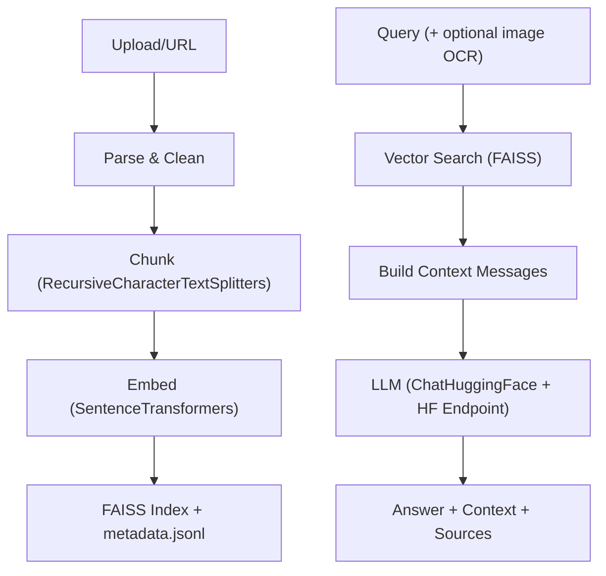

# Smart RAG API
FastAPI-powered Retrieval-Augmented Generation service that ingests PDFs, Word files, text, images (OCR), CSVs, and SQLite databases, indexes them with FAISS, and answers questions using a Hugging Face LLM — with clean chunking, file metadata, and source icons.

Highlights
- Multi-format ingestion: .pdf, .docx, .txt, .jpg/.png (OCR), .csv, .db (SQLite)
- Clean text pre-processing + LangChain RecursiveCharacterTextSplitter chunking
- Embeddings via SentenceTransformers; vector search via FAISS (cosine)
- LLM: LangChain ChatHuggingFace + HuggingFaceEndpoint (meta-llama/Llama-3.1-8B-Instruct by default)
- OCR for images and scanned PDFs (pytesseract)
- Persistent vector store on disk
- User-friendly responses: file_id, file-type icons, type labels, pages/chunks/scores
- Async I/O + threadpool offloading for performance
- Memory-safe PDF ingestion (streaming, DPI/pixel caps)

--------------------------------------------------------------------------------

Architecture
- Ingestion:
  1) Extract text (PyMuPDF, python-docx, pandas, sqlite3, OCR)
  2) Clean text (normalize Unicode, de-hyphenate, collapse whitespace)
  3) Chunk with LangChain RecursiveCharacterTextSplitter
  4) Embed (SentenceTransformers) and store in FAISS + metadata.jsonl

- Query:
  1) Optional OCR from base64 image
  2) Vector search on question (and OCR text)
  3) Build chat prompt from top-k chunks
  4) Generate answer using LLM (HF endpoint)
  5) Return answer + context + sources (with icons/labels)

Mermaid


Tech Stack
- FastAPI, Uvicorn
- SentenceTransformers (all-MiniLM-L6-v2)
- FAISS (faiss-cpu)
- LangChain (ChatHuggingFace + HuggingFaceEndpoint)
- LLM: meta-llama/Llama-3.1-8B-Instruct (Hugging Face Hosted Inference API)
- PyMuPDF, python-docx, pandas, pytesseract
- Python 3.10 recommended

--------------------------------------------------------------------------------

Installation

Prerequisites
- Python 3.10 (64-bit recommended)
- Tesseract OCR
- Hugging Face account + access token (and accept the model license for meta-llama/Llama-3.1-8B-Instruct)

Windows (default)
1) Install Python 3.10 (64-bit)
- winget install -e --id Python.Python.3.10
- Or download: https://www.python.org/downloads/release/python-31013/
- Check “Add Python to PATH” during installation

2) Install Tesseract OCR
- Windows builds: https://github.com/UB-Mannheim/tesseract/wiki
- Default path: C:\Program Files\Tesseract-OCR\tesseract.exe

3) Clone and create venv
- git clone <this-repo> && cd <repo>
- python -m venv .venv
- .\.venv\Scripts\Activate.ps1
- Set-ExecutionPolicy -Scope Process -ExecutionPolicy Bypass (if activation is blocked)

4) Install dependencies
- python -m pip install -U pip setuptools wheel
- Install Torch (CPU) first for Windows stability:
  - pip install --index-url https://download.pytorch.org/whl/cpu torch==2.3.1
- Install the rest:
  - pip install -r requirements.txt

5) Setup environment
- Create .env from “Sample .env” below and fill your token
- On Windows, set TESSERACT_PATH if Tesseract isn’t on PATH

6) Run
- uvicorn main:app --reload --port 8000 --env-file .env
- Health check: http://localhost:8000/health

Linux
- sudo apt-get update && sudo apt-get install -y tesseract-ocr
- Python 3.10:
  - Use your distro’s packages or pyenv
- Create venv, install dependencies:
  - python -m venv .venv && source .venv/bin/activate
  - python -m pip install -U pip setuptools wheel
  - pip install --index-url https://download.pytorch.org/whl/cpu torch==2.3.1
  - pip install -r requirements.txt
- Copy .env and run:
  - uvicorn main:app --reload --port 8000 --env-file .env

macOS
- brew install tesseract
- Python 3.10:
  - brew install python@3.10 (or use pyenv)
- Create venv, install deps:
  - python3.10 -m venv .venv && source .venv/bin/activate
  - python -m pip install -U pip setuptools wheel
  - pip install --index-url https://download.pytorch.org/whl/cpu torch==2.3.1
  - pip install -r requirements.txt
- Copy .env and run:
  - uvicorn main:app --reload --port 8000 --env-file .env

--------------------------------------------------------------------------------

Environment Setup

Sample .env
```
# --- Hugging Face / LLM ---
HUGGINGFACEHUB_API_TOKEN=hf_your_token_here
LLM_REPO_ID=meta-llama/Llama-3.1-8B-Instruct
LLM_TEMPERATURE=0.2
LLM_MAX_NEW_TOKENS=384
LLM_TOP_P=0.95
LLM_TOP_K=50
LLM_TIMEOUT=60

# --- Embeddings / Storage ---
EMBEDDING_MODEL=sentence-transformers/all-MiniLM-L6-v2
STORAGE_DIR=storage

# --- Chunking / Retrieval ---
CHUNK_SIZE=900
CHUNK_OVERLAP=200
TOP_K=5

# --- Ingestion limits / OCR ---
MAX_DB_ROWS=200
PDF_OCR_DPI=200
PDF_OCR_MAX_PIXELS=5000000

# --- OCR (Windows path example) ---
# Prefer forward slashes or escaped backslashes
# Leave unset on Linux/macOS or if on PATH
TESSERACT_PATH=C:/Program Files/Tesseract-OCR/tesseract.exe
```

Notes
- Accept the model license on the Hugging Face model page to use Llama 3.1 8B Instruct.
- python-dotenv auto-loads .env; you can also pass --env-file .env to uvicorn.

--------------------------------------------------------------------------------

API Usage

Base URL
- http://localhost:8000

Interactive Mode

- http://localhost:8000/docs

Endpoints
- GET /health
  - Returns status, index size, models in use, OCR settings
- POST /upload (multipart/form-data)
  - fields: files=@path/to/file (repeatable)
  - Returns per-file summary including file_id
- POST /ingest_url (JSON)
  - body: {"url": "https://example.com/document.pdf"}
  - Ingests a remote file by URL
- POST /query (JSON)
  - body:
    - question: string
    - image_base64: optional base64 image string (OCR will be applied)
    - top_k: optional int (defaults to 5, limited to 5 to keep prompt small)
  - Returns:
    - answer: string
    - context: top chunks with text, file_id, filename, type, icon, page, score, etc.
    - sources: source metadata aligned with the context

Examples

- Upload files
```
curl -X POST "http://localhost:8000/upload" \
  -H "accept: application/json" \
  -H "Content-Type: multipart/form-data" \
  -F "files=@./docs/invoice.pdf" \
  -F "files=@./data/products.csv"
```

Response
```
{
  "message": "Ingestion complete",
  "total_chunks": 37,
  "files": [
    { "filename": "invoice.pdf", "file_id": "file_3f1a9c2e4d6b", "chunks": 22 },
    { "filename": "products.csv", "file_id": "file_9a7b4e1c2f0d", "chunks": 15 }
  ]
}
```

- Ingest by URL
```
curl -X POST "http://localhost:8000/ingest_url" \
  -H "Content-Type: application/json" \
  -d '{"url":"https://example.com/mydoc.pdf"}'
```

- Ask a question
```
curl -X POST "http://localhost:8000/query" \
  -H "Content-Type: application/json" \
  -d '{"question": "What does the invoice say about payment terms?", "top_k": 3}'
```

- Ask with an image (OCR)
```python
import base64, requests
with open("photo.png", "rb") as f:
    b64 = base64.b64encode(f.read()).decode()
r = requests.post("http://localhost:8000/query", json={
    "question": "What is written in this image?",
    "image_base64": b64,
    "top_k": 3
})
print(r.json())
```

Sample /query response snippet
```
{
  "answer": "The invoice specifies Net 30 payment terms.",
  "context": [
    {
      "text": "Payment terms: Net 30 ...",
      "file_id": "file_3f1a9c2e4d6b",
      "filename": "invoice.pdf",
      "type": "pdf",
      "type_label": "PDF document",
      "icon": "📕",
      "page": 3,
      "chunk_index": 0,
      "id": 42,
      "score": 0.89
    }
  ],
  "sources": [
    {
      "id": 42,
      "file_id": "file_3f1a9c2e4d6b",
      "filename": "invoice.pdf",
      "type": "pdf",
      "type_label": "PDF document",
      "icon": "📕",
      "page": 3,
      "chunk_index": 0,
      "score": 0.89
    }
  ]
}
```

--------------------------------------------------------------------------------

Project Layout
- main.py — FastAPI app, ingestion/parsing, embeddings, FAISS store, RAG prompt, endpoints
- requirements.txt — Python dependencies
- storage/ — persisted FAISS index and metadata.jsonl (created at runtime)

--------------------------------------------------------------------------------

Troubleshooting
- 401/403 on /query:
  - Ensure HUGGINGFACEHUB_API_TOKEN is set and valid
  - Accept the model license on meta-llama/Llama-3.1-8B-Instruct
- 500 on /query:
  - Often HF endpoint issues or large prompts; try top_k=2–3
  - Switch to a smaller model by changing LLM_REPO_ID in .env if needed
- “Tesseract not found” or empty OCR:
  - Install Tesseract and set TESSERACT_PATH on Windows, or ensure it’s on PATH
- NumPy errors (Windows):
  - Pin numpy==1.26.4 (already in requirements.txt)
  - Install Torch CPU wheel first, then the rest
- FAISS install issues (Windows):
  - pip install faiss-cpu==1.7.4
  - If still failing, consider Conda or Docker
- Memory error on large PDFs:
  - Lower PDF_OCR_DPI and/or PDF_OCR_MAX_PIXELS in .env
  - Reduce CHUNK_SIZE (e.g., 600) and CHUNK_OVERLAP (e.g., 120)

--------------------------------------------------------------------------------

Notes

- Security: Don’t commit your .env or tokens. Use env vars or secret managers in production.

